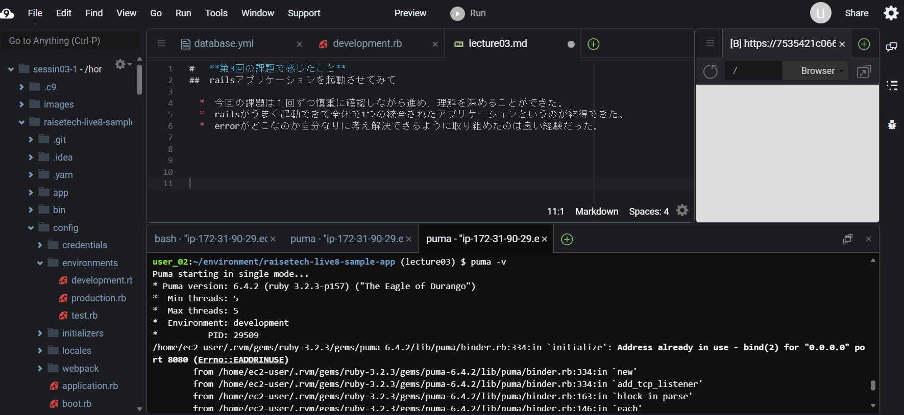
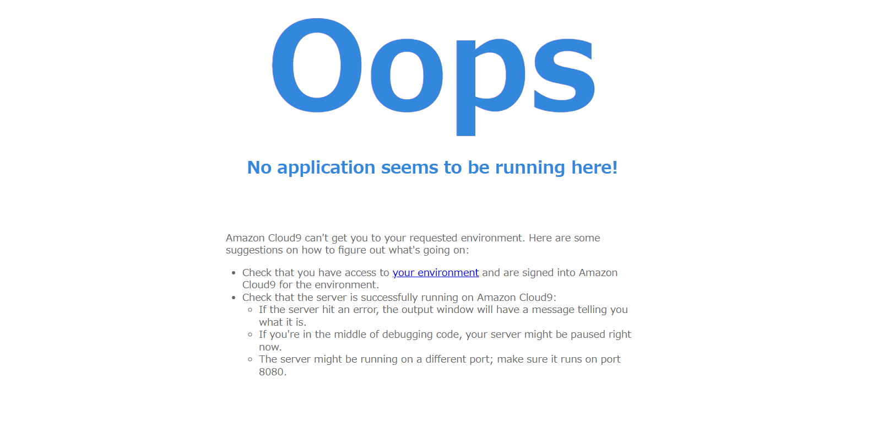
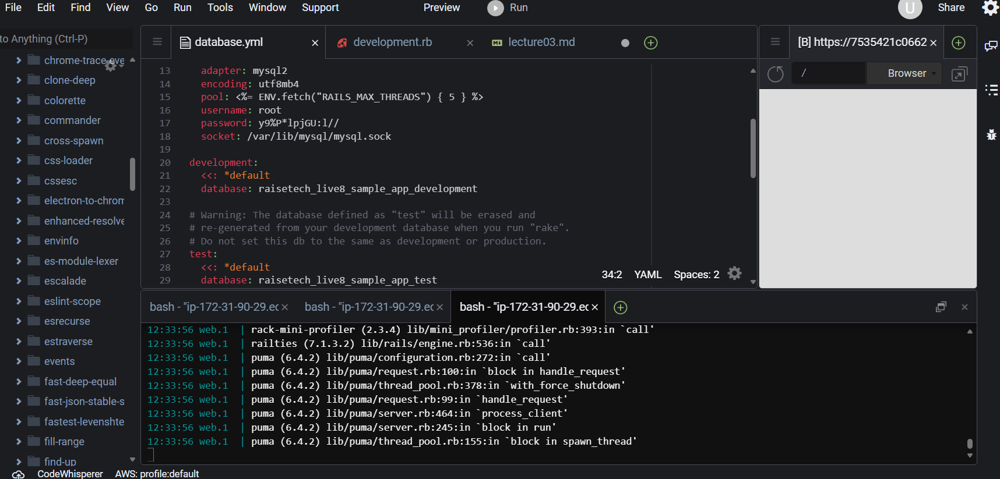
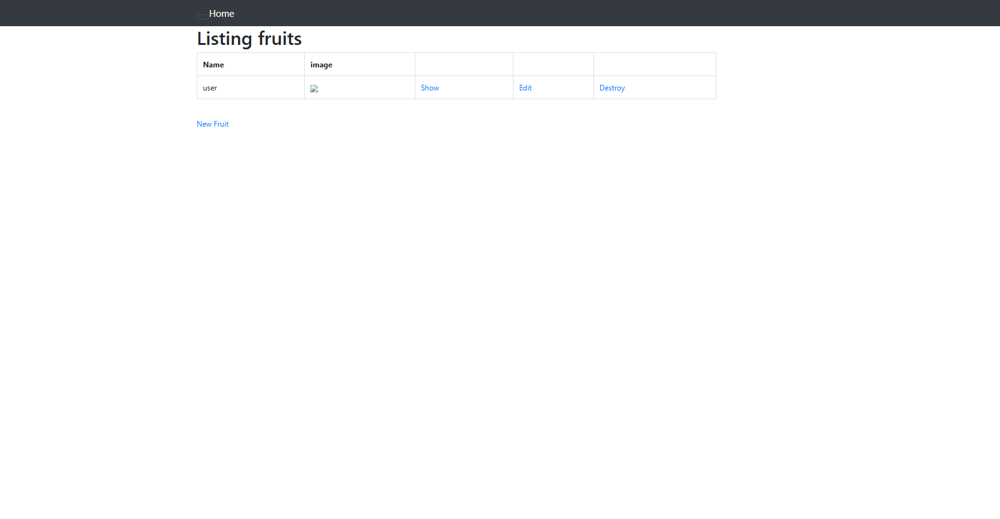
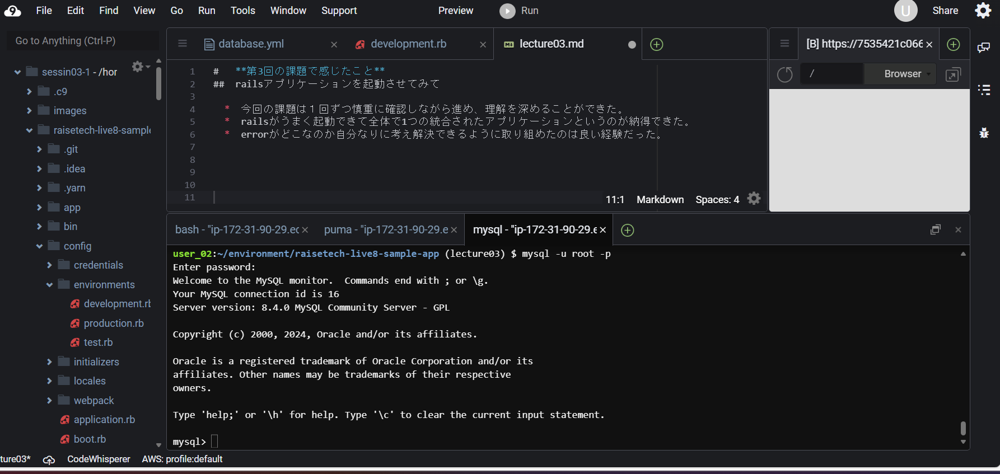
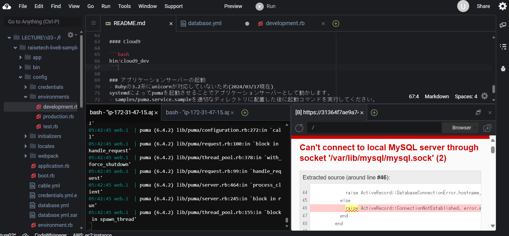
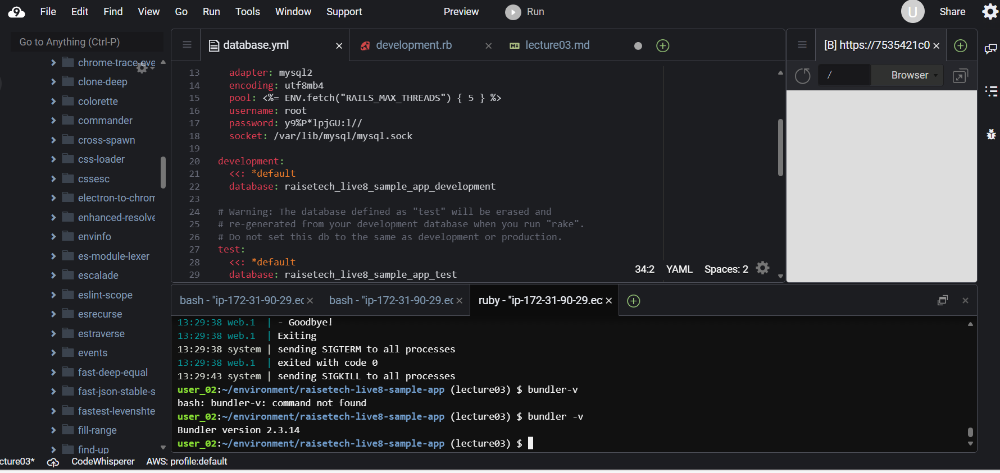

## 第３回課題

* APサーバーの名前とバージョン （puma ver6.4.2)  　    　
　　

* APサーバーを終了させた場合  (アクセスできない)  
  

* APサーバーを再起動させた場合 　　　　
  
  

* DBサーバーの名前とバージョン(Mysql ver8.4.0)    
 

* DBサーバーを終了させた場合  (アクセスできない)  
 

* Railsの構成管理ツール(Bundler)　　
 

* 第3回の課題を通して感じたこと     
　Railsアプリケーションの稼働まで時間がかかってしまった。  
  エラーの原因を解消しながらすすめる作業は勉強になりました。　　